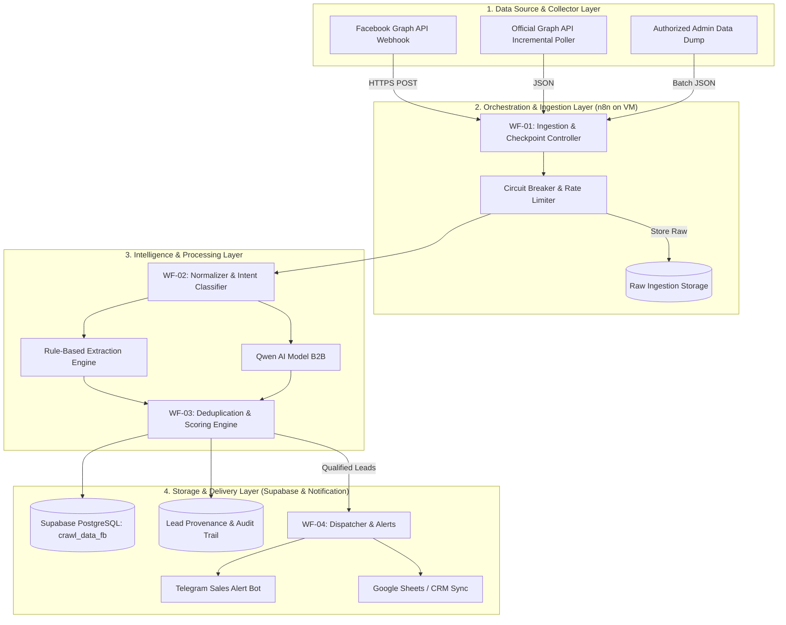

# Hệ thống Facebook Lead Intelligence V1 - Architecture Overview

## 1. Mục tiêu & Phạm vi V1
Hệ thống **Facebook Lead Intelligence V1** được thiết kế nhằm tự động hóa quy trình phát hiện, phân loại, trích xuất và bàn giao khách hàng tiềm năng (Leads) trong lĩnh vực **xây dựng, kỹ thuật công trình và phần mềm kỹ thuật** (sản phẩm trọng tâm: Robot xây dựng bê tông, enjiCAD/AutoCAD alternative, phần mềm kết cấu CSi/ETABS, phần mềm địa kỹ thuật PLAXIS/GEO5, thiết bị thí nghiệm kiểm định công trình).

### Phạm vi V1 (Scope Boundary):
* **Nền tảng mục tiêu:** Facebook (Fanpage hợp lệ, Page Webhooks, Group hợp lệ, và các nguồn dữ liệu Facebook được cấp quyền truy cập chính thống).
* **Không triển khai trong V1:** TikTok, Zalo, LinkedIn, YouTube hoặc các nền tảng khác.
* **Orchestration Layer:** **n8n** (tự lưu trữ trên Docker VM `crawl-fb-cic`).
* **Database chính:** **PostgreSQL / Supabase** (Project `crawl_data_fb` - ID: `qllwfecwujzhuwexrlqi`).
* **AI Intelligence Engine:** **Qwen AI** (Private endpoint B2B `qwen3-vl-30b` / `Qwen-2.5`) kết hợp Rule-based Regex Engine để triệt tiêu ảo giác (zero hallucination).

---

## 2. Các nguyên tắc thiết kế bất biến (14 Core Principles)

1. **Không xây dựng CAPTCHA solver:** Tuyệt đối không tích hợp hay sử dụng các dịch vụ giải captcha (2captcha, anti-captcha...).
2. **Không bypass anti-bot:** Không chèn mã can thiệp cơ chế bảo vệ của Facebook/Cloudflare.
3. **Không fingerprint spoofing:** Không giả lập canvas, audio fingerprint, TLS client hello nhằm che giấu danh tính bot.
4. **Không fake human behavior:** Không giả lập chuột di chuyển ngẫu nhiên, scroll trang giả vờ như người dùng thật.
5. **Không account farm:** Không vận hành mạng lưới clone nick ảo/via/clone để thu thập dữ liệu trái phép.
6. **Không proxy rotation nhằm né block:** Không sử dụng residential/mobile proxy xoay vòng để né hạn mức truy cập.
7. **Không spam request:** Tôn trọng Rate Limit của Facebook Graph API và hạ tầng mạng; có rate limiter nội bộ.
8. **Cơ chế giảm tải/dừng source khi gặp lỗi:** Khi gặp lỗi `429 Too Many Requests`, `OAuthException (Invalid Token)`, hoặc `Permission Denied`, hệ thống tự động kích hoạt backoff hoặc tạm ngưng source tương ứng và cảnh báo Admin.
9. **Checkpoint & Incremental Collection:** Collector thu thập theo cơ chế con trỏ (cursor/timestamp checkpoint). Tuyệt đối không quét lại toàn bộ dữ liệu lịch sử gây lãng phí tài nguyên và rủi ro rate limit.
10. **Bất biến dữ liệu thô (Raw Data Immutability):** Dữ liệu thô từ Facebook được ghi nhận nguyên bản vào bảng `raw_fb_payloads` trước khi qua bất kỳ bộ lọc hay AI nào. AI không được phép ghi đè lên dữ liệu thô.
11. **Không hallucinate thông tin khách hàng:** AI không được suy đoán thông tin cá nhân. Nếu nguồn không có SĐT/Email/Tên công ty thì giá trị trường bắt buộc là `NULL`.
12. **Không tự suy đoán liên hệ:** Phải kiểm chứng thực tế bằng trích xuất chuỗi (deterministic string/regex extraction) kết hợp thẩm định ngữ cảnh của AI.
13. **Nguồn gốc dữ liệu đầy đủ (Source Provenance):** Mọi lead tạo ra phải gắn liền với ID bài viết (`post_id`), ID bình luận (`comment_id`), thời điểm đăng, đường dẫn gốc (`permalink_url`), phiên bản prompt và model AI đã trích xuất.
14. **Thiết kế Modular (Decoupled Collector):** Collector độc lập hoàn toàn với lớp xử lý (Processing Layer). Chuẩn hóa giao tiếp qua **Standard Ingestion Envelope (JSON Schema)**, cho phép thay thế hoặc nâng cấp collector mà không ảnh hưởng đến n8n hay database.

---

## 3. Kiến trúc tổng thể 4 tầng (4-Tier Architecture)

---

## 4. Đặc thù nghiệp vụ ngành Xây dựng (Construction Intelligence)
Hệ thống được tối ưu phân loại intent và sản phẩm cho ngành xây dựng:

| Nhóm sản phẩm | Sản phẩm cụ thể | Dấu hiệu Intent mua hàng (High Buying Intent) |
| :--- | :--- | :--- |
| **Robot Xây dựng** | Robot gạt phẳng bê tông, xoa nền, xoa mịn, kiểm tra trạm biến áp | Hỏi giá máy xoa, hỏi diện tích làm việc/h, cần thuê máy thi công, hỏi chính sách bảo hành |
| **Phần mềm CAD** | enjiCAD, CMS IntelliCAD | Xin báo giá license vĩnh viễn, hỏi giá 5-10 máy, hỏi thay thế AutoCAD cho công ty |
| **Kết cấu & Công trình** | CSi ETABS, SAP2000, SAFE | Cần mua bản quyền dự án, hỏi nâng cấp version, hỏi đào tạo tính toán kết cấu |
| **Địa kỹ thuật & Nền móng**| PLAXIS 2D/3D, GEO5 | Báo giá phần mềm xử lý lún nứt, tính ổn định hố đào, tính cọc khoan nhồi |
| **Thiết bị đo đạc/kiểm định**| Máy Radar xuyên đất (GPR), Máy quét Laser 3D, NDT | Yêu cầu khảo sát công trình, kiểm tra khuyết tật bê tông cốt thép, xin catalog kỹ thuật |
